# 📘 Detailed Project Documentation: Kimia Farma Performance Analytics

**Project Name:** Kimia Farma Business Performance Evaluation (2020–2023)  
**Role:** Big Data Analytics Intern  
**Program:** Rakamin Academy x Kimia Farma  
**Date:** February 2026  
**Status:** Completed  

---

## 1. Executive Summary

### 1.1 Overview
This project entails a comprehensive end-to-end data analytics solution designed to evaluate the business performance of **PT Kimia Farma Tbk**, Indonesia's largest state-owned pharmaceutical company. The analysis covers a four-year period (2020–2023), transforming raw transactional, inventory, and branch data into a unified analytical model and an interactive business intelligence dashboard.

### 1.2 Business Problem
Kimia Farma manages a vast network of branches across the Indonesian archipelago. Prior to this analysis, performance data was siloed across multiple CSV datasets, making it difficult to:
*   Accurately calculate **Nett Profit** due to complex, tiered margin structures based on product pricing.
*   Correlate **Branch Operational Ratings** with **Transaction Experience Ratings** to identify specific service bottlenecks.
*   Visualize geographic profitability disparities between core markets (e.g., Java) and emerging markets (e.g., Eastern Indonesia).

### 1.3 Solution Delivered
A robust data pipeline was engineered using **Google BigQuery** to create a "Single Source of Truth" (`analysis_table`). This fed into a dynamic **Google Looker Studio** dashboard that provides:
*   Real-time monitoring of Revenue, Profit, and Transaction Volume.
*   Geographic heatmaps of profitability.
*   Gap analysis of customer satisfaction metrics.
*   Strategic recommendations for supply chain optimization and operational audits.

---

## 2. Business Context & Objectives

### 2.1 The Client: PT Kimia Farma Tbk
*   **Industry:** Pharmaceutical & Healthcare.
*   **Scope:** Nationwide retail and distribution network.
*   **Key Challenge:** Balancing high-volume sales with profitable margins while maintaining consistent customer experience standards across diverse regions.

### 2.2 Project Objectives
1.  **Data Unification:** Ingest and merge four distinct datasets (`kf_final_transaction`, `kf_product`, `kf_kantor_cabang`, `kf_inventory`) into a relational model.
2.  **Complex Metric Modeling:** Implement specific business logic to calculate `nett_sales` and `nett_profit` using a **tiered gross profit margin** structure (10% – 30%).
3.  **Performance Diagnosis:** Identify top-performing provinces and detect "at-risk" branches where store reputation exceeds transaction satisfaction.
4.  **Strategic Enablement:** Empower management with an interactive tool to drill down from national KPIs to specific branch-level anomalies.

### 2.3 Scope of Analysis
*   **Time Period:** January 1, 2020 – December 31, 2023.
*   **Geographic Scope:** All active Kimia Farma branches in Indonesia.
*   **Data Granularity:** Individual transaction line items.

---

## 3. Data Architecture & Pipeline

### 3.1 Overview
The data pipeline follows a modern **ELT (Extract, Load, Transform)** architecture leveraging **Google Cloud Platform (GCP)**. Raw data is ingested directly into the data warehouse, where complex transformations are applied using standard SQL to create a unified analytical model.

### 3.2 Architecture Layers

#### **Layer 1: Source (Raw Data)**
Four distinct CSV datasets serve as the foundation:
*   `kf_final_transaction`: Transactional logs (ID, Date, Customer, Price, Discount, Rating).
*   `kf_product`: Product catalog (SKU, Name, Category, Base Price).
*   `kf_kantor_cabang`: Branch master data (Branch ID, Name, City, Province, Branch Rating).
*   `kf_inventory`: Stock levels (Used for context, though not directly joined in the final performance view).

#### **Layer 2: Transformation (Google BigQuery)**
The core logic resides in Google BigQuery. A single **Analysis Table** (`analysis_table`) is created by joining the source tables.
*   **Join Logic:** `transaction` ⨝ `product` (on `product_id`) ⨝ `branch` (on `branch_id`).
*   **Key Transformations:**
    *   **Data Cleaning:** Ensuring consistent data types for dates and numeric values.
    *   **Business Logic Implementation:**
        *   Calculation of `nett_sales` (Price adjusted for discount).
        *   Dynamic assignment of `persentase_gross_laba` using tiered `CASE WHEN` logic based on product price brackets.
        *   Derivation of `nett_profit` (Nett Sales × Gross Profit %).
    *   **Normalization:** Unifying branch and product details into the transactional grain.

#### **Layer 3: Presentation (Google Looker Studio)**
The `analysis_table` serves as the **Single Source of Truth (SSOT)** for visualization.
*   **Connection:** Direct live connection from Looker Studio to BigQuery.
*   **Function:** Aggregates data on-the-fly for interactive filtering (Date, Province) and renders KPIs, trends, and geographic maps.

### 3.3 Data Flow Diagram
The following diagram illustrates the end-to-end flow from raw ingestion to executive insight:

```mermaid
graph LR
    subgraph Source["📂 Source Layer (CSV)"]
        T[kf_final_transaction]
        P[kf_product]
        B[kf_kantor_cabang]
        I[kf_inventory]
    end

    subgraph Warehouse["🏗️ Transformation Layer (Google BigQuery)"]
        SQL[SQL Transformation Logic]
        AT[(analysis_table)]
        
        T --> SQL
        P --> SQL
        B --> SQL
        
        SQL -- "Joins & Calculations" --> AT
    end

    subgraph Viz["📊 Presentation Layer (Looker Studio)"]
        DS[Interactive Dashboard]
        AT --> DS
    end

    Source --> Warehouse
    Warehouse --> Viz

    style Source fill:#f9f9f9,stroke:#333,stroke-width:2px
    style Warehouse fill:#e8f0fe,stroke:#1a73e8,stroke-width:2px
    style Viz fill:#e6f4ea,stroke:#0f9d58,stroke-width:2px
```



### 3.4 Key Technical Decisions

*   **Why Google BigQuery?**
    Chosen for its **serverless architecture**, which eliminates infrastructure management overhead. It was selected specifically for its **seamless native integration** with Google Looker Studio for real-time visualization.

*   **Why a Unified Analysis Table?**
    Instead of writing complex multi-table joins directly in the visualization layer (which significantly slows down dashboard rendering), we **pre-computed a wide "Single Source of Truth" table** in BigQuery.
    *   *Benefit:* This ensures **fast dashboard load times** for end-users.
    *   *Benefit:* It guarantees **consistent metric definitions** (e.g., `nett_profit`) across all charts, preventing calculation discrepancies.

*   **Adherence to the DRY Principle (Don't Repeat Yourself)**
    The transformation logic utilizes **Common Table Expressions (CTEs)** to calculate the tiered margin percentages (`persentase_gross_laba`) exactly **once**.
    *   *Benefit:* This prevents code duplication within the SQL script.
    *   *Benefit:* It ensures **data integrity**; if business logic changes (e.g., margin thresholds), updates only need to be made in one central location.

---

## 4. Transformation Logic & Business Rules

### 4.1 Overview
The core value of this project lies in the accurate implementation of Kimia Farma's specific business rules within the SQL transformation layer. Instead of calculating metrics on-the-fly in the visualization tool (which can lead to inconsistencies), all complex logic was pre-computed in Google BigQuery to ensure a **Single Source of Truth**.

### 4.2 Key Metric Definitions

#### **A. Nett Sales (`nett_sales`)**
*   **Definition:** The actual revenue recognized after applying customer discounts.
*   **Business Rule:** Raw product prices (`actual_price`) must be adjusted by the transaction-specific `discount_percentage`.
*   **Formula:**
    $$ \text{nett\_sales} = \text{actual\_price} \times \left(1 - \frac{\text{discount\_percentage}}{100}\right) $$
*   **Implementation:** Calculated directly in the `SELECT` clause of the analysis table.

#### **B. Tiered Gross Profit Margin (`persentase_gross_laba`)**
*   **Definition:** Kimia Farma applies a progressive margin structure based on product price points. Higher-priced items yield higher margin percentages.
*   **Business Rule:** The margin % is determined strictly by the `actual_price` (pre-discount) of the product.
*   **Logic Table:**

| Price Range (IDR) | Gross Profit Margin (%) |
| :--- | :--- |
| `price` ≤ 50,000 | **10%** |
| 50,000 < `price` ≤ 100,000 | **15%** |
| 100,000 < `price` ≤ 300,000 | **20%** |
| 300,000 < `price` ≤ 500,000 | **25%** |
| `price` > 500,000 | **30%** |

*   **SQL Implementation:** Implemented using a `CASE WHEN` statement. To adhere to the **DRY (Don't Repeat Yourself)** principle, this logic is computed once in a CTE (Common Table Expression) and referenced for profit calculations.

#### **C. Nett Profit (`nett_profit`)**
*   **Definition:** The gross profit earned on a specific transaction line item.
*   **Business Rule:** Profit is derived from the *Nett Sales* value multiplied by the *Tiered Margin*.
*   **Formula:**
    $$ \text{nett\_profit} = \text{nett\_sales} \times \text{persentase\_gross\_laba} $$
*   **Implementation:** Uses the pre-calculated `nett_sales` and the result of the `CASE WHEN` logic.

### 4.3 Data Quality & Integrity Measures
To ensure the reliability of the `analysis_table`, the following measures were applied during transformation:
1.  **Inner Joins Only:** Used `INNER JOIN` between Transaction, Product, and Branch tables to ensure only valid transactions with existing products and branches are included. Orphaned records are excluded.
2.  **Explicit Casting:** Ensured numeric fields (`price`, `discount_percentage`) are treated as floats to prevent integer division errors during percentage calculations.
3.  **Null Handling:** The `CASE WHEN` logic includes an `ELSE 0` clause to handle any unexpected null or negative price values, preventing calculation errors.

### 4.4 Code Snippet Reference
The core logic implemented in `sql/create_analysis_table.sql`:

```sql
-- Calculate Margin Percentage ONCE
CASE
  WHEN p.price <= 50000 THEN 0.10
  WHEN p.price > 50000 AND p.price <= 100000 THEN 0.15
  WHEN p.price > 100000 AND p.price <= 300000 THEN 0.20
  WHEN p.price > 300000 AND p.price <= 500000 THEN 0.25
  WHEN p.price > 500000 THEN 0.30
  ELSE 0.0
END AS persentase_gross_laba
```

---

## 5. Visualization Strategy & Insights

### 5.1 Overview
The visualization layer in **Google Looker Studio** is designed not just to display data, but to tell a cohesive story about Kimia Farma's performance from 2020 to 2023. Each chart addresses a specific strategic question derived from the business objectives defined in Section 2.

### 5.2 Dashboard Components & Strategic Mapping

#### **A. Executive Summary Header**
*   **Visual Type:** Scorecards with Sparklines.
*   **Metrics Displayed:** Total Revenue (`SUM(nett_sales)`), Total Profit (`SUM(nett_profit)`), Total Transactions (`COUNT(transaction_id)`), Avg Transaction Rating (`AVG(rating_transaksi)`).
*   **Strategic Question:** *"What is the high-level health of the business right now?"*
*   **Key Insight:** Provides immediate context on the scale of operations (e.g., **346.96B IDR Revenue**) and overall customer satisfaction trends. The sparklines offer instant visibility into whether metrics are trending up or down compared to the previous period.

#### **B. Year-over-Year Revenue Trend**
*   **Visual Type:** Line Chart with Trend Line.
*   **Strategic Question:** *"Is the company growing consistently, or are there volatility patterns?"*
*   **Key Insight:** Reveals a fluctuating trajectory with a peak in 2022 (**87.1B IDR**) followed by a dip in 2023 back to 2021 levels (**86.5B IDR**). This highlights a potential stagnation or market pressure in the most recent year that requires management attention.

#### **C. Regional Performance: Volume vs. Value**
*   **Visual Type:** Sorted Bar Charts (Top 10 Provinces).
*   **Charts:**
    1.  *Top 10 Provinces by Transaction Volume.*
    2.  *Top 10 Provinces by Nett Sales.*
*   **Strategic Question:** *"Which regions are driving our business, and is volume correlating with value?"*
*   **Key Insight:** **Jawa Barat** dominates both charts, contributing ~30% of national volume and value.

#### **D. Operational Gap Analysis (The "Wow" Factor)**
*   **Visual Type:** Scatter Plot.
*   **Axes:** X-Axis = `rating_cabang` (Branch Rating), Y-Axis = `rating_transaksi` (Transaction Rating).
*   **Strategic Question:** *"Are there branches where customers love the store but hate the checkout experience?"*
*   **Key Insight:** Identifies critical outliers like **Tarakan** and **Bekasi**. These branches have high facility ratings (>4.4) but low transaction ratings (<3.99). This specific gap points to operational bottlenecks (e.g., long queues, POS issues, staff training) rather than facility problems, allowing for targeted interventions.

#### **E. Geographic Profitability Heatmap**
*   **Visual Type:** Filled Map (Choropleth).
*   **Metric:** `SUM(nett_profit)`.
*   **Strategic Question:** *"Where is the actual profit being generated, and are there 'hidden' loss-makers?"*
*   **Key Insight:** Confirms **Jawa Barat** as the primary profit engine (**29.1B IDR**). Conversely, it highlights emerging markets in Eastern Indonesia (Papua, Kalimantan) that, while operational, contribute minimally to the bottom line (<1B IDR), prompting a review of logistics costs vs. margin potential in those areas.

### 5.3 Interactivity & User Experience
*   **Global Filters:** The dashboard includes controls for **Date Range** and **Province**, allowing stakeholders to drill down from national KPIs to specific regional performance instantly.
*   **Cross-Filtering:** Clicking on a specific province in the Map automatically filters the Trend Line and Scatter Plot, enabling root-cause analysis without needing multiple reports.

---

## 6. Conclusion & Future Work

### 6.1 Project Summary
This project successfully delivered an end-to-end analytics solution for PT Kimia Farma Tbk. By engineering a robust data pipeline in BigQuery and implementing complex tiered margin logic, we created a **Single Source of Truth** that powers a dynamic, insight-driven dashboard. The analysis uncovered critical findings regarding geographic concentration, revenue stagnation, and operational gaps in customer experience.

### 6.2 Strategic Recommendations
Based on the data:
1.  **Defend the Core:** Optimize supply chain efficiency in **Jawa Barat** to protect the 30% revenue contribution.
2.  **Fix the Gap:** Conduct immediate operational audits in **Tarakan** and **Bekasi** to address the discrepancy between branch and transaction ratings.
3.  **Review Emerging Markets:** Perform a cost-benefit analysis for branches in Eastern Indonesia to determine if profitability can be improved via margin optimization or if restructuring is needed.

### 6.3 Future Enhancements
*   **Inventory Integration:** Incorporate `kf_inventory` data to analyze stock-out rates and their correlation with lost sales.
*   **Predictive Modeling:** Use historical trends to forecast Q1-Q2 2024 revenue and identify potential risks before they occur.
*   **Customer Segmentation:** Deepen the analysis by segmenting customers based on purchase frequency and product category preferences.

---
